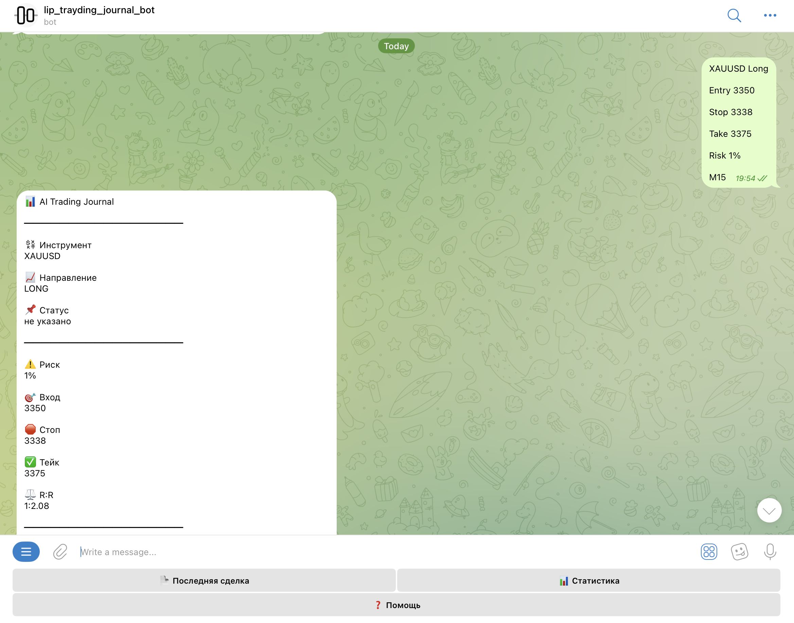
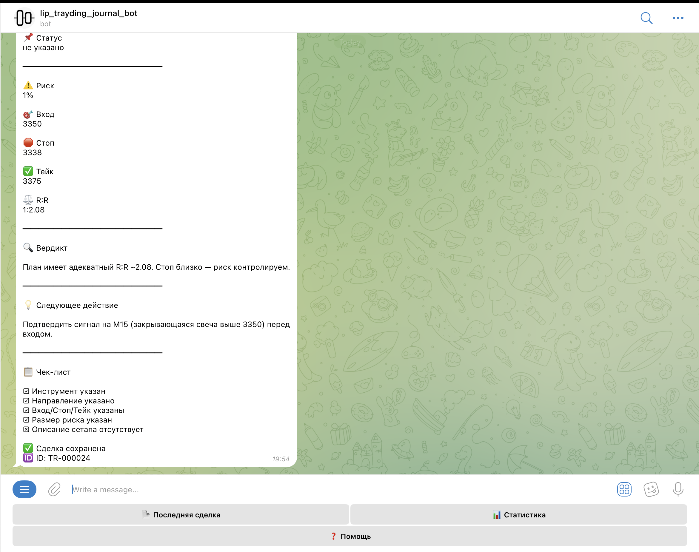

# AI Trading Journal

AI Trading Journal is a Telegram bot that helps traders record, analyze and review every trade in one place.

The project was built to automate my own trading journal and reduce repetitive manual work. Instead of writing every trade into spreadsheets by hand, the bot extracts trade information, analyzes the setup with AI, saves everything into Google Sheets and provides statistics in real time.

---

## Features

- Record trades directly from Telegram
- AI analysis for every trade
- Automatic calculation of Risk/Reward
- Win Rate statistics
- Trading history stored in Google Sheets
- Most traded instruments
- Most used setups
- Timeframe statistics
- Last trade summary
- Fully automated workflow with n8n

---

## Tech Stack

- n8n
- Telegram Bot API
- OpenAI API
- Google Apps Script
- Google Sheets
- JavaScript

---

## Screenshots

### Trade analysis

### AI verdict

## Project Architecture

Telegram User

↓

Telegram Bot

↓

n8n Workflow

↓

OpenAI

↓

Google Apps Script

↓

Google Sheets

↓

Statistics API

↓

Telegram Response

---

## Why I built this project

I wanted to learn how AI automation works in practice by building something I would actually use every day.

Trading requires keeping a detailed journal, but writing everything manually takes time and quickly becomes repetitive. This project automates the entire process, allowing trades to be recorded, analyzed and reviewed directly inside Telegram.

While building it, I learned how to connect multiple services into one workflow, work with APIs, process JSON data, write JavaScript for automation and integrate Google Apps Script with Google Sheets.

---

## Future Improvements

- Web dashboard
- Advanced analytics
- Charts
- Trade filtering
- Authentication
- Cloud deployment

---

## Author

Maxim Lipashov
